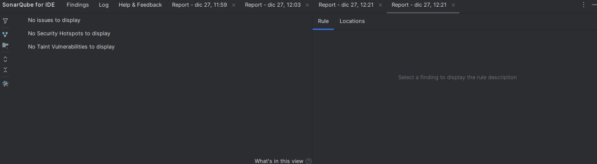

# 📚 Sistema de Gestión de Biblioteca (Evaluación 3)

Este proyecto consiste en una solución basada en **Microservicios** para la gestión de préstamos de libros en una biblioteca. La arquitectura permite el desacoplamiento de responsabilidades, facilitando el mantenimiento y la escalabilidad de cada componente.

## 🏗️ Arquitectura del Sistema

El sistema está compuesto por tres microservicios que se comunican entre sí mediante **Spring Cloud OpenFeign**:

1.  **Microservicio de Usuarios**: Gestiona el registro y estado (activo/inactivo) de los lectores.
2.  **Microservicio de Libros**: Administra el catálogo de libros y el control de stock en tiempo real.
3.  **Microservicio de Préstamos**: Orquesta la lógica de negocio principal, validando la disponibilidad de libros y la vigencia de los usuarios antes de registrar un préstamo.

## 🛠️ Tecnologías Utilizadas

-   **Java 21**
-   **Spring Boot 3.x**
-   **Spring Data JPA** (Persistencia de datos)
-   **PostgreSQL** (Base de Datos)
-   **Spring Cloud OpenFeign** (Comunicación declarativa entre servicios)
-   **MapStruct** (Mapeo de DTOs a Entidades)
-   **Lombok** (Reducción de código repetitivo)
-   **Springdoc OpenAPI / Swagger** (Documentación de APIs)

## ⚙️ Configuración del Entorno

Para proteger la información sensible, el proyecto utiliza variables de entorno. Sigue estos pasos para configurar el entorno local:

1. En la raíz de **cada microservicio**, crea un archivo llamado `.env`.
2. Completa el archivo con los siguientes parámetros (ajustando a tu configuración local):

```env
# Base de Datos
DB_USERNAME=tu_usuario
DB_PASSWORD=tu_password
DB_URL=jdbc:postgresql://localhost:5432/nombre_de_tu_db

# URLs de Servicios (Solo requerido en microservicio-prestamos)
LIBROS_URL=http://localhost:8081
USUARIOS_URL=http://localhost:8082
Manejo de Excepciones: Se implementó un @RestControllerAdvice para capturar errores de comunicación de Feign y convertirlos en respuestas HTTP claras.

Validación de Datos: Uso de Bean Validation para asegurar que los datos de entrada cumplan con los formatos requeridos.
```
## 🚀 Guía de Pruebas con Postman

Se ha incluido una colección de Postman diseñada para probar tanto los CRUDs individuales como los flujos complejos de negocio de manera automatizada.

### Cómo importar la colección:
1. Localiza el archivo `Biblioteca_Digital.postman_collection.json` en la raíz de este repositorio.
2. En Postman, haz clic en **Import** y arrastra el archivo.

### Flujo Completo (Automatizado):
La colección incluye una carpeta llamada **"FLUJO COMPLETO - Ejecutar en orden"**. Esta carpeta cuenta con scripts (Tests) que permiten:

* **Automatización**: Al crear un usuario o libro, el ID generado se guarda automáticamente en variables de entorno de Postman.
* **Trazabilidad**: Permite ejecutar el flujo completo (desde la creación de datos hasta la devolución del préstamo) sin necesidad de copiar o pegar IDs manualmente.

---

## 📖 Documentación de la API (Swagger)

Una vez iniciados los servicios, puedes acceder a la documentación interactiva y realizar pruebas directamente desde el navegador en las siguientes rutas:

* **Libros**: [http://localhost:8081/swagger-ui.html](http://localhost:8081/swagger-ui.html)
* **Usuarios**: [http://localhost:8082/swagger-ui.html](http://localhost:8082/swagger-ui.html)
* **Préstamos**: [http://localhost:8083/swagger-ui.html](http://localhost:8083/swagger-ui.html)

---

## 📋 Funcionalidades Principales

### 💳 Préstamos
* **Crear Préstamo**: Valida automáticamente que el usuario exista y esté activo, y que el libro cuente con stock disponible.
* **Devolución**: Registra la fecha de retorno y restaura automáticamente el stock del libro mediante comunicación entre servicios.
* **Consultas Avanzadas**: Búsqueda de préstamos por ID, por usuario específico o filtrado por estado (solo activos).

### 📚 Libros y Usuarios
* Gestión completa de **CRUD** con validaciones de integridad referencial.
* Control estricto de **stock** y disponibilidad de ejemplares.

---

## 💡 Detalles de Implementación

* **Manejo Global de Excepciones**: Se implementó un `@RestControllerAdvice` que centraliza los errores de servicios externos (Feign) y validaciones de negocio, garantizando respuestas estandarizadas y claras.
* **Validación de Datos**: Uso de `Bean Validation` para asegurar la calidad y el formato de los datos de entrada en cada request.
* **Arquitectura DTO**: Implementación de objetos de transferencia de datos para desacoplar el modelo de persistencia de la capa de presentación, protegiendo la integridad de las entidades.

---

## 📈 Calidad de Código y Estándares

El proyecto ha sido analizado con **SonarQube**, asegurando el cumplimiento de las mejores prácticas de desarrollo, mantenibilidad y seguridad. El reporte muestra un estado "Clean", libre de vulnerabilidades críticas y con una cobertura de estándares de codificación profesional.



*Nota: La imagen superior muestra el resumen del análisis donde se validan los estándares de calidad aplicados en este proyecto.*

